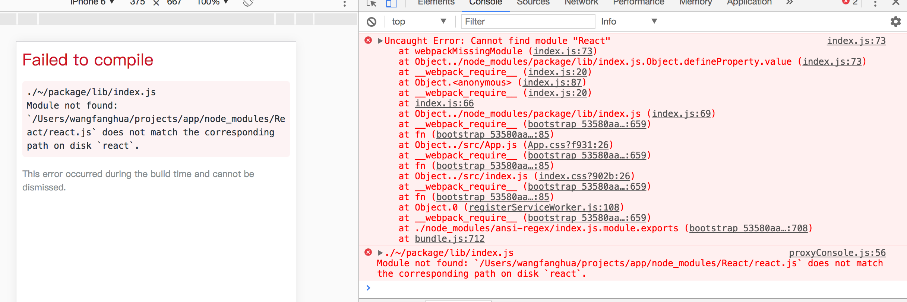

# NPM包

## 包结构

    package
        |
        |--->lib
        |
        |
        |--->test
        |
        |
        |--->doc
        |
        |
        |--->bin
        |
        |
        |--->package.json
        |
        |
        |--->readMe.md

# webpack配置说明
* 不配置library且使用export{o}导出方式
```
// src
output{
    path: path.join(__dirname, 'lib'),
        filename: 'index.js',
        libraryTarget: 'commonjs'
}
export {o};
// target
import {o} from 'package';//此处就是结构对象，换成oo就会出错
```
* 不配置library且使用export default o导出方式
```
output{
    path: path.join(__dirname, 'lib'),
        filename: 'index.js',
        libraryTarget: 'commonjs'
}
export default o;
//target
import o from 'package';
但是o.default才是真正的要导出的对象，因为default是关键字，不能使用结构对象方式

```

* 第一种方式
    // index.js
    ```
    let o = {
    name: "monkey",
    getName: () => {
        return o.name;
    },
    setName: (name) => {
        o.name = name;
    }
    }

    export default o ;
    ```
    // app.js
    ```
    import o from 'package';//此处的o随意命名，代表最外层对象
    // import {default} from 'package';//报错，default是关键字

    console.log("===>", o.default.name);

    ```
    // webpack.config.js
    ```
    output: {
        path: path.join(__dirname, 'lib'),
        filename: 'index.js',
        libraryTarget: 'commonjs'
    }
    ```
* 第二种方式
    // index.js
    ```
    let o = {
    name: "monkey",
    getName: () => {
        return o.name;
    },
    setName: (name) => {
        o.name = name;
    }
    }

    export { o };
    ```
    // app.js
    ```
    // 第1种
    import o from 'package';//此处的o随意命名，代表最外层对象
    // import {default} from 'package';//报错，default是关键字

    console.log("===>", o.o.name);
    // 第2种
    import {o} from 'package';//就是结构对象

    console.log('banner==>', o.name);

    ```
    // webpack.config.js
    ```
    output: {
        path: path.join(__dirname, 'lib'),
        filename: 'index.js',
        libraryTarget: 'commonjs'
    }
    ```
* 第三种方式
   // index.js
    ```
    let o = {
    name: "monkey",
    getName: () => {
        return o.name;
    },
    setName: (name) => {
        o.name = name;
    }
    }

    export default o ;
    ```
    // app.js
    ```
    import o from 'package';//此处的o随意命名，代表最外层对象
    //import {banner} from 'package';

    console.log("===>", o.banner.default.name);
    //console.log("===>", banner.default.name);

    ```
    // webpack.config.js
    ```
    output: {
        path: path.join(__dirname, 'lib'),
        filename: 'index.js',
        library: 'banner',
        libraryTarget: 'commonjs'
    }
    ```
    * 第四种方式
   // index.js
    ```
    let o = {
    name: "monkey",
    getName: () => {
        return o.name;
    },
    setName: (name) => {
        o.name = name;
    }
    }

    export { o };
    ```
    // app.js
    ```
    import o from 'package';//此处的o随意命名，代表最外层对象
    //import {banner} from 'package';

    console.log("===>", o.banner.o.name);
    //console.log("===>", banner.o.name);

    ```
    // webpack.config.js
    ```
    output: {
        path: path.join(__dirname, 'lib'),
        filename: 'index.js',
        library: 'banner',
        libraryTarget: 'commonjs'
    }
    ```

总结：
    作为组件使用，尽量不用library，尽量不用default导出。

* external 碰到的问题

    external配置:react:"React"，会产生找不到包的问题。

    改成: react: "react"。

    原因是：webpack对大小写敏感，而node_modules中react是小写，用大写则找不到对应的包

    问题：
    